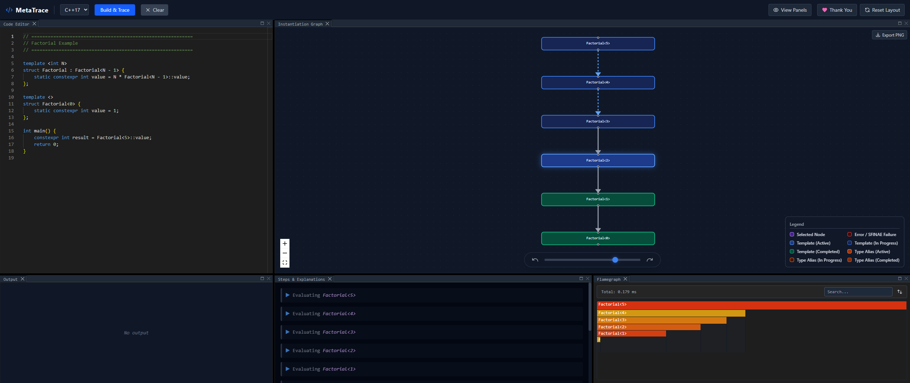

<div align="center">
  <h1>MetaTrace</h1>
  <p><strong>A highly visual, standalone Desktop tool to trace and debug C++ Template Metaprogramming and SFINAE instantiation steps using an embedded Clang compiler.</strong></p>
  <br>
  
</div>

---

## 🔍 Overview
**MetaTrace** gives you an X-Ray view into the C++ compiler's template instantiation process. If you have ever stared at a multi-page compiler error or wondered why a specific SFINAE template specialization wasn't chosen, MetaTrace is for you.

By utilizing a custom-built LLVM Clang plugin hooked up to a rich, hardware-accelerated frontend UI, MetaTrace visualizes the tree of template instantiations, type aliases, and SFINAE failures as a clean, interactive directed graph.

## ✨ Features
- **Real-Time Interactive Graph:** Watch templates instantiate and unfold in a node-based interface as you type code.
- **Embedded Editor:** Features a built-in Monaco (VS Code) editor with full C++ syntax highlighting.
- **Standalone Desktop App:** Distributed as a single, fully-packaged executable without any external dependencies (like Node or Python). Just run it and it launches in a native window using your system browser.
- **Integrated LSP:** Includes full clangd-based Language Server Protocol support for auto-complete and hover documentation.
- **C++ Standard Selection:** Toggle compiler versions on-the-fly from C++98 up to C++26.
- **SFINAE Debugging:** Failed template substitutions and their precise error reasons are highlighted in red directly on the node graph.

## 🚀 How to Use
If you download a pre-built binary release, using MetaTrace is incredibly easy:
1. Double click `MetaTrace.exe`.
2. The application will start its local backend and automatically pop open a dedicated UI window.
3. Write your C++ templates in the editor on the left.
4. Watch the template instantiation graph build on the right in real-time. 

## 🛠️ Building from Source

If you want to build the project from scratch, you will need **Node.js (v18+)** and **Visual Studio (with C++ CMake tools)** installed on your machine.

### 1. Clone the repository
```bash
git clone https://github.com/your-username/MetaTrace.git
cd MetaTrace
```

### 2. Install dependencies
```bash
npm run install:all
```
*This command will install the dependencies for both the frontend UI and the Node.js backend proxy server.*

### 3. Build the LLVM Clang Plugin (Visualizer)
MetaTrace ships with a custom C++ compiler frontend built against LLVM. 
```bash
cd backend/plugin
mkdir build
cd build
cmake ..
cmake --build . --config Release
```

### 4. Run the Dev Server
To run the app locally with hot-reloading for the frontend UI:
```bash
# Terminal 1: Start the backend server
cd backend
npm run dev

# Terminal 2: Start the frontend dev server
cd frontend
npm run dev
```

### 5. Package into a Standalone Binary
To compile the frontend, bundle the backend, embed the Clang plugin, and package everything into a single `.exe`:
```bash
# From the project root
npm run build
```
The final standalone binary will be located in the `release/` directory.

## 🤝 Contributing

Contributions are what make the open-source community such an amazing place to learn, inspire, and create. Any contributions you make are **greatly appreciated**.

To start contributing:
1. **Fork the Project**
2. **Create your Feature Branch** (`git checkout -b feature/AmazingFeature`)
3. **Commit your Changes** (`git commit -m 'Add some AmazingFeature'`)
4. **Push to the Branch** (`git push origin feature/AmazingFeature`)
5. **Open a Pull Request**

### Areas for Contribution
- **Graph Layouts:** Improving the Dagre/VueFlow node positioning for massive, deeply nested template metaprograms.
- **CMake Support:** Expanding the tool to support analyzing templates across multiple files and `CMakeLists.txt` projects instead of just single files.
- **UI/UX Tweaks:** Improving the dark mode palette, adding minimaps, or extending the hover tooltips.

## 📝 License
Distributed under the MIT License.
