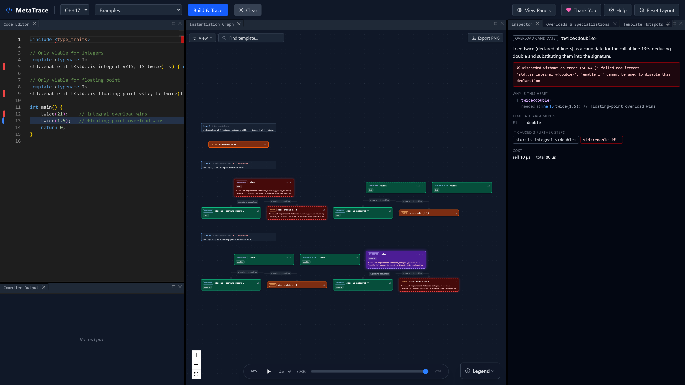
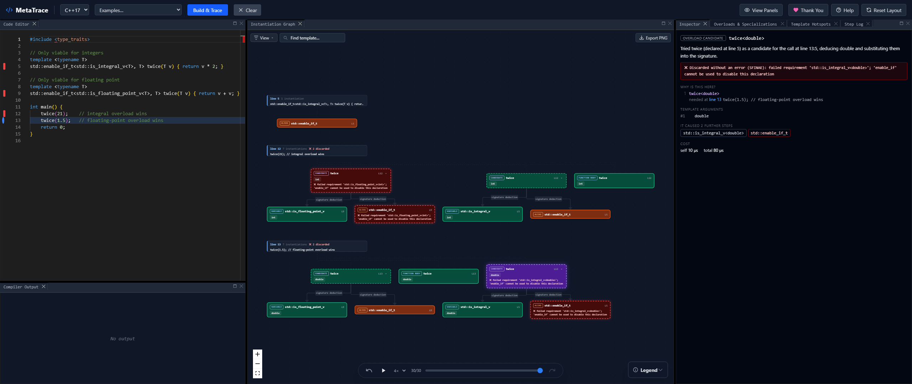

<div align="center">
  <h1>MetaTrace</h1>
  <p><strong>See what the C++ compiler does with your templates.</strong></p>
  <p>
    <a href="https://github.com/ashwani762/MetaTrace/actions/workflows/ci.yml"></a>
    <a href="LICENSE"></a>
    
    
  </p>
  
</div>

---

MetaTrace compiles your code with an embedded Clang and records **every template instantiation, every overload candidate it tries, and why candidates are thrown away**. It then shows all of this as an interactive graph you can step through like a debugger.

## Highlights

| | |
|---|---|
| **Instantiation graph** | One card per compiler step, grouped under the line of your code that caused it. Results appear on the card (`value = 55`, `type = int`), along with cache reuse (♻) and base cases. Recursion folds into one card (`↻ 11 levels ‹12› → … → ‹2›`). |
| **Inspector** | Explains any step in plain English: what happened, *why it is there* (the chain back to your code), which arguments changed, and what it cost. |
| **Overloads & specializations** | Every candidate for every call: selected, rejected by **SFINAE**, or discarded by unmet **concepts**, with Clang's exact reason. For viable losers it gives the ranking rule that decided it (*less specialized*, *less constrained*, *worse reference binding*…). It also shows which partial specialization matched. |
| **Constraint trees** | See how `(Number<T> && Small<T>) \|\| is_pointer_v<T>` was evaluated: every concept expanded, each atom marked satisfied, failed or short-circuited. |
| **Template hotspots** | Templates ranked by compile time, with instantiation counts, cache reuse and recursion depth. |
| **Time travel** | Scrub or play the compilation step by step (← → ↑ ↓, Space). |
| **Readable at scale** | Simple view hides compiler bookkeeping, *Hide std internals*, collapsible subtrees, search. Tested on real code using `tuple`, `variant`, ranges and concepts. |
| **Friendly to newcomers** | A guided tour on first visit and curated examples (recursion, SFINAE, concepts, type lists, CRTP…). |

<details>
<summary><strong>Ultrawide screenshot</strong></summary>
<br>

</details>

## Quick start

1. Download the latest package for **Windows** or **Linux** from [Releases](https://github.com/ashwani762/MetaTrace/releases). CI also attaches packages to every build.
2. Run `MetaTrace` (or `MetaTrace.exe`) and open **http://localhost** in your browser.
3. Pick an example from **Examples…**, or write your own templates and click **Build & Trace**.

> You need the C++ standard library headers that are normally installed with a compiler: Visual Studio (MSVC) on Windows, or `g++`/`build-essential` on Linux. Use `--port 8080` if port 80 is taken.

## Build from source

```bash
git clone https://github.com/ashwani762/MetaTrace.git
cd MetaTrace
npm run install:all
# Windows (x64 Native Tools prompt)            # Linux
set LLVM_PATH=C:\path\to\llvm-22               export LLVM_PATH=/usr/lib/llvm-22
npm run build                                  npm run build
```

The packaged binary is written to `release/`. See the **[Developer & User Guide](docs/GUIDE.md)** for LLVM setup, the dev server, tests, CI, and how everything works.

## Documentation

- **[Guide](docs/GUIDE.md)**: every panel explained, reading the graph, examples, keyboard shortcuts, architecture, trace format, building, testing and releasing.

## Contributing

Contributions are very welcome. Fork the repo, create a branch, and open a pull request. CI runs every test on Windows and Linux. See [Contributing](docs/GUIDE.md#contributing) for good first areas.

## License

Distributed under the MIT License. See [LICENSE](LICENSE).
